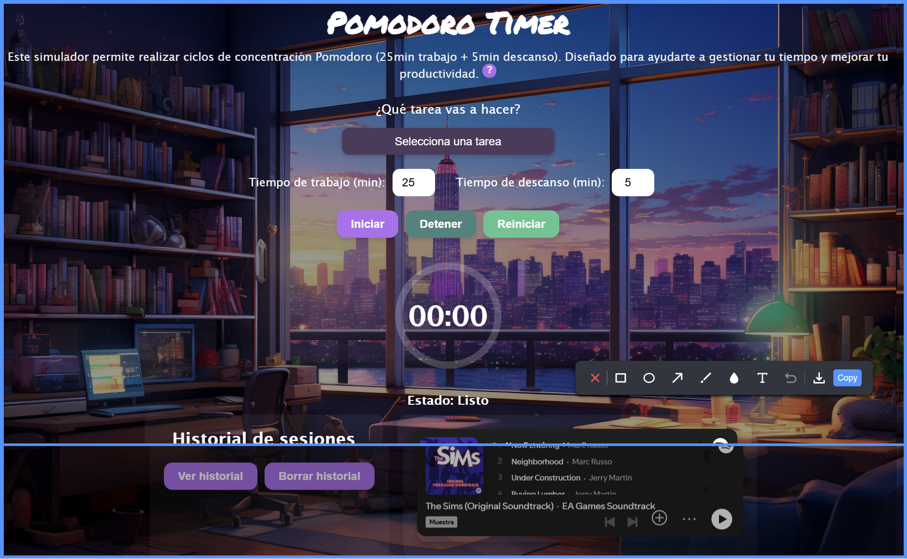

# Constanza's Portfolio - Web Development & Digital Marketing

## 🌐 Live Demo
[](https://constanzaramos.github.io/coramba/)

## 📌 Description
This is the personal portfolio of **Constanza Ramos**, a frontend developer and digital marketing specialist. The site showcases her experience, projects, and skills in web development, UX, SEO, and digital strategies.

## 🚀 Features
- 🌍 **Multilingual**: Supports English and Spanish with `i18next`.
- 🎨 **Responsive Design**: Optimized for both mobile and desktop devices.
- ⚡ **Interactivity**: Built using HTML, CSS, and vanilla JavaScript.
- 🔍 **SEO Optimized**: Includes meta tags and Open Graph for social media sharing.
- 🏗 **Improved Accessibility**: Complies with `A11Y` standards for inclusive navigation.
- 📄 **Adaptable Resume**: Section with CV available in both English and Spanish.

## 🛠 Technologies Used
- **Frontend**: HTML5, CSS3, JavaScript (ES6)
- **Libraries**: Boxicons, i18next
- **Tools**: GitHub, Formspree (for contact forms)

## 📖 Installation and Usage
1. Clone this repository:
   ```sh
   git clone https://github.com/constanzaramos/coramba-portfolio.git
   ```
2. Open `index.html` in your browser.
## 📸 Capturas
 
 


## 📬 Contact
If you have any suggestions or would like to collaborate, you can reach me via:
- 💼 [LinkedIn](https://www.linkedin.com/in/constanzaramos/)
- 📧 [Email](c.ramosgamboa@gmail.com)

